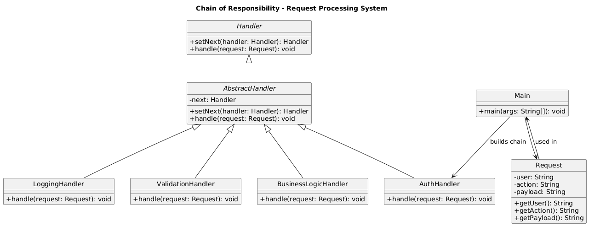

# 🧾 Request Processing System (Console-Based)

---

## 🎯 Objective

To build a **console-based Request Processing System** using clean, object-oriented design principles and the **Chain of Responsibility Design Pattern**.

---

## 📦 Features

- Modular chain of handlers for request processing
- Validates user authentication and action correctness
- Supports basic in-memory `CRUD` operations
- Clearly logged console output for every stage
- Easy to extend with new processing steps (e.g., rate limiting, authorization)
- Fully **extensible**, **modular**, and **cleanly structured**

---

## 🧠 Architecture & Modules

### 1. Request Model

- `Request` class holds:
    - `user` → who is sending the request
    - `action` → what to do (`CREATE`, `UPDATE`, `DELETE`)
    - `payload` → the data associated with the action

---

### 2. Chain of Responsibility Design Pattern

| Concept             | Implementation                        |
|---------------------|----------------------------------------|
| **Handler Interface** | `Handler`                             |
| **Base Handler**    | `AbstractHandler` with `setNext()`     |
| **Concrete Handlers** | `AuthHandler`, `ValidationHandler`, `BusinessLogicHandler`, `LoggingHandler` |
| **Client**          | `Main` class to build and trigger the chain |

> ✅ This pattern lets us pass a request along a chain of handlers where each one decides whether to process or pass it further.

---

### 3. Handler Responsibilities

- `AuthHandler`: Validates user presence.
- `ValidationHandler`: Validates action type and payload.
- `BusinessLogicHandler`: Performs CRUD operations on an in-memory map.
- `LoggingHandler`: Logs the entire request once processed.

Each handler either processes and passes forward, or short-circuits the chain on error.

---

### 4. User Interaction

- `Main` class:
    - Creates and chains all handlers.
    - Sends example requests through the handler pipeline.
    - Demonstrates success and failure scenarios (unauthenticated user, invalid action, etc.)

---

## 🔁 Supported Actions

| Action  | Payload Format       | Example Input             |
|---------|----------------------|---------------------------|
| CREATE  | Just value            | `"New Entry"`             |
| UPDATE  | `id:value` format     | `"1:Updated Entry"`       |
| DELETE  | Just ID               | `"1"`                     |

---

## 🏁 Chain of Responsibility Pattern – Recap

> The Chain of Responsibility pattern lets a request pass through a chain of potential handlers until one of them handles it.

### ✅ Why It’s Useful Here

- Completely decouples sender and processor
- Prevents long nested if-else chains
- Makes the pipeline modular and extensible
- Cleanly separates different concerns

---

## 📈 Future Enhancements

- Add `AuthorizationHandler` for role-based control
- Add `RateLimitingHandler` to prevent abuse
- Persist logs or data into file or database
- Add support for `READ` and `LIST` actions
- Retry or fallback handlers for robustness

---

## 📊 UML Diagram (Adapter Pattern)

You can visualize the Chain of Responsibility Pattern like this:

---

---

## 🏆 Outcome

You’ve built a **real-world**, **console-driven**, and **pattern-powered** Java application that demonstrates the practical usage of the **Chain of Responsibility** design pattern.

This project showcases:
- Clean separation of concerns using handlers
- Flexible request processing pipelines
- Easy scalability by adding/removing handlers
- How behavioral patterns enhance modularity in software design

The system is **modular**, **maintainable**, and ready to evolve into more advanced use cases like middleware frameworks, rule engines, or even request interceptors in real applications.

---
