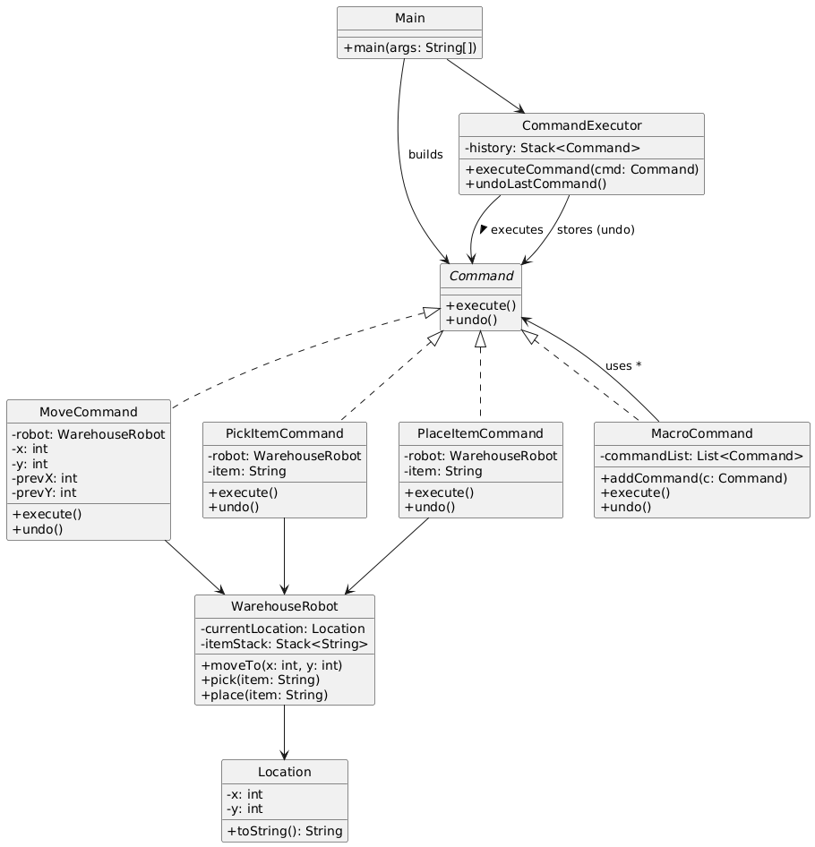

# 🤖 Warehouse Robot Controller (Console-Based)

---

## 🎯 Objective

To build a **console-based Warehouse Robot Controller** using clean, object-oriented design principles and the **Command Design Pattern**.

---

## 📦 Features

- Move robot to specified coordinates
- Pick and place items at current location
- Undo the last executed command
- Execute a series of operations as a **macro command**
- All interaction happens via an intuitive **console menu**
- Fully **extensible**, **modular**, and **cleanly structured**

---

## 🧠 Architecture & Modules

### 1. Command Model

- `Command` interface defines:
    - `execute()` → perform the command
    - `undo()` → rollback the command (for undo support)

---

### 2. Command Design Pattern

| Concept               | Implementation                                                        |
|------------------------|------------------------------------------------------------------------|
| **Command Interface**   | `Command`                                                              |
| **Concrete Commands**   | `MoveCommand`, `PickItemCommand`, `PlaceItemCommand`, `MacroCommand`   |
| **Receiver**            | `WarehouseRobot` – performs the actual logic of move/pick/place        |
| **Invoker**             | `CommandExecutor` – triggers and stores commands                      |
| **Client**              | `Main` – builds and dispatches commands from user input               |

> ✅ This pattern decouples the object that issues the command from the one that knows how to execute it.

---

### 3. Command Responsibilities

- `MoveCommand`: Moves robot to specified coordinates.
- `PickItemCommand`: Picks an item at the current location.
- `PlaceItemCommand`: Places an item at the current location.
- `MacroCommand`: A batch of multiple commands executed as a single unit (and undone in reverse order).

---

### 4. User Interaction

- `Main` class:
    - Presents a console menu
    - Accepts user input to move, pick, place
    - Supports executing macro commands
    - Allows undoing the last command

---

## 🛠️ Supported Operations

| Operation   | Console Action            | Example Input                     |
|------------|---------------------------|----------------------------------|
| MOVE       | Move robot to (x, y)       | `x = 2`, `y = 3`                 |
| PICK       | Pick item by name          | `"Box123"`                       |
| PLACE      | Place item by name         | `"Box123"`                       |
| MACRO      | Queue multiple commands    | [MOVE, PICK, PLACE, etc.]       |
| UNDO       | Undo last command          | (No input needed)               |

---

## 🏁 Command Pattern – Recap

> The Command Pattern turns a request into a standalone object containing all the information about the request, allowing you to parameterize clients, delay execution, queue commands, or support undoable operations.

### ✅ Why It’s Useful Here

- Clean separation between UI logic and robot logic
- Enables features like undo, command logging, macros
- Simplifies extension with new robot capabilities
- Encourages reusable, encapsulated actions

---

## 📈 Future Enhancements

- Add support for `Redo` stack
- Add `ScanBarcodeCommand`, `SortShelfCommand`
- Support command persistence/logging
- Visualize robot movement on a grid
- Integrate simple REST API or GUI

---

## 📊 UML Diagram (Command Pattern)

You can visualize the Command Design Pattern like this:

---

## 🏆 Outcome

You’ve built a **real-world**, **console-driven**, and **pattern-powered** Java application that demonstrates the practical usage of the **Command Design Pattern**.

This project showcases:
- Clean separation of commands and robot logic
- Flexible and reusable operation invocations
- Undo and macro support
- How behavioral patterns enhance modularity in software design

The system is **modular**, **maintainable**, and ready to evolve into more advanced use cases like GUI controllers, schedulers, or event-driven workflows.

---
