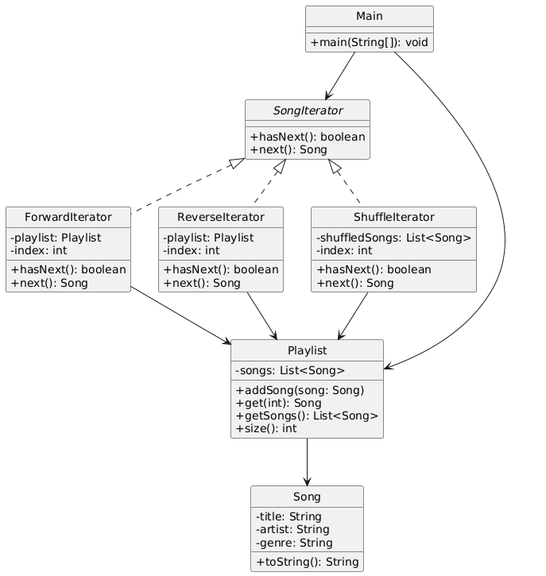

# 🎧 Playlist Manager (Console-Based)

---

## 🎯 Objective

To build a **console-based Playlist Manager** using clean, object-oriented design principles and the **Iterator Design Pattern**.

---

## 📦 Features

- Add and manage a playlist of songs
- Play songs using different traversal modes:
    - Forward
    - Reverse
    - Shuffle
- Demonstrates real-world usage of custom iterators
- Fully **extensible**, **modular**, and **cleanly structured**

---

## 🧠 Architecture & Modules

### 1. Song Model

- `Song` class includes:
    - `title`
    - `artist`
    - `genre`
- Clean `toString()` representation for display

---

### 2. Iterator Design Pattern

| Concept              | Implementation                                 |
|----------------------|-------------------------------------------------|
| **Iterator Interface** | `SongIterator`                                |
| **Concrete Iterators**| `ForwardIterator`, `ReverseIterator`, `ShuffleIterator` |
| **Aggregate**        | `Playlist` stores the song list                |
| **Client**           | `Main` class with console menu interaction     |

> ✅ This pattern encapsulates the traversal logic separately from the collection, allowing flexible and safe iteration over a complex structure.

---

### 3. Iteration Modes

- **ForwardIterator** → Traverse songs from beginning to end
- **ReverseIterator** → Traverse songs from end to beginning
- **ShuffleIterator** → Randomly order and play songs

---

### 4. User Interaction

- `Main` class:
    - Loads sample songs
    - Provides console menu for choosing playback order
    - Uses the selected iterator to display the playlist

---

## 🏁 Iterator Pattern – Recap

> The **Iterator Pattern** provides a way to access elements of a collection sequentially without exposing its underlying representation.

### ✅ Why It’s Useful Here

- Decouples traversal logic from the data structure
- Enables multiple traversal modes without modifying collection
- Enhances modularity and open/closed design principles
- Makes code easier to test and maintain

---

## 📈 Future Enhancements

- Add filtering iterators (by artist, genre, etc.)
- Add GUI or TUI (text-based UI) for better navigation
- Support paginated iteration (e.g., 5 songs at a time)
- Load songs from a file or external source

---

## 📊 UML Diagram (Iterator Pattern)

---

## 🏆 Outcome

You’ve built a **real-world**, **console-driven**, and **pattern-powered** Java application that demonstrates the practical usage of the **Iterator Design Pattern**.

This project showcases:
- Clean and decoupled traversal logic
- Flexible and extendable collection access
- Multiple custom iterators for different use cases

The system is **modular**, **maintainable**, and ready to evolve into more advanced playlist or media management applications.
