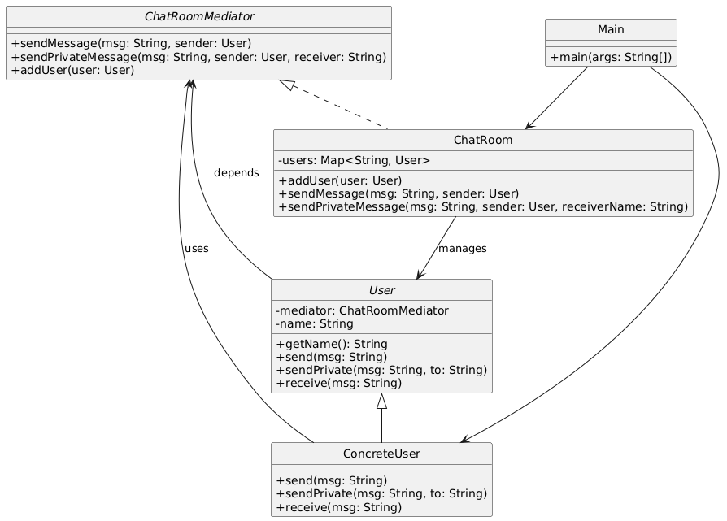

# 💬 Chat Room Simulator (Console-Based)

---

## 🎯 Objective

To build a **console-based Chat Room Simulator** using clean, object-oriented design principles and the **Mediator Design Pattern**.

---

## 📦 Features

- Simulates a basic text-based chat room
- Users can send:
    - **Broadcast messages** to all users
    - **Private messages** to specific users
- Centralized **mediator** controls all message delivery
- No direct communication between user objects
- Fully **modular**, **decoupled**, and **easy to extend**

---

## 🧠 Architecture & Modules

### 1. User Model

- `User` (abstract class):
    - Represents a chat participant
    - Defines `send()`, `sendPrivate()`, and `receive()` methods
- `ConcreteUser`:
    - Implements actual message sending/receiving behavior

---

### 2. Mediator Design Pattern

| Concept             | Implementation                      |
|---------------------|--------------------------------------|
| **Mediator Interface** | `ChatRoomMediator`               |
| **Concrete Mediator** | `ChatRoom`                       |
| **Colleague (User)** | `User`                            |
| **Concrete Colleague** | `ConcreteUser`                  |
| **Client**          | `Main` class to create users & send messages |

> ✅ The mediator handles all routing logic, avoiding direct coupling between users.

---

### 3. Message Types

- **Broadcast**: Sent to all users except sender.
- **Private**: Sent to a specific user by name.
- Handles unknown recipient cases gracefully.

---

### 4. User Interaction

- `Main` class:
    - Creates a chat room and users
    - Simulates real-time chat exchange
    - Demonstrates both message types

---

## 🏁 Mediator Pattern – Recap

> The Mediator Pattern promotes **loose coupling** by keeping objects from referring to each other explicitly, and lets you vary their interaction independently.

### ✅ Why It’s Useful Here

- Clean separation of concerns
- Central control over communication
- Easy to add logging, filtering, or protocol enforcement later
- Prevents a spider web of direct dependencies between users

---

## 📈 Future Enhancements

- Add timestamp or message history logging
- Add online/offline user tracking
- Allow group messaging or rooms
- Add a console-based UI loop for real-time interaction

---

## 📊 UML Diagram (Mediator Pattern)

---

## 🏆 Outcome

You’ve built a **real-world**, **console-driven**, and **pattern-powered** Java application that demonstrates the practical usage of the **Mediator Design Pattern**.

This project showcases:
- Centralized message control
- Loose coupling between interacting objects
- A foundation for more complex messaging systems

The system is **clean**, **modular**, and ready for extensions like moderation, logging, or multi-room chats.