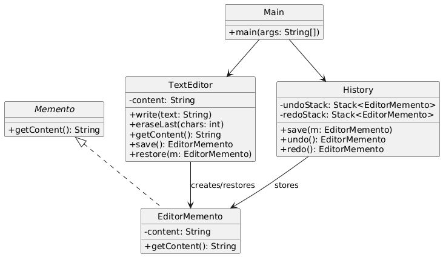

# 📝 Text Editor (Console-Based)

---

## 🎯 Objective

To build a **console-based Text Editor** with **Undo** and **Redo** support using the **Memento Design Pattern**.  
This demonstrates how to capture and restore an object’s internal state without exposing its internals.

---

## 📦 Features

- Type content using `write()` method
- Undo and redo text modifications
- Stores historical snapshots of editor state
- Clean modular design with single responsibility per class
- Ready to be extended to support cursor, formatting, or multi-document editors

---

## 🧠 Architecture & Modules

### 1. Text Editor (Originator)

- `TextEditor` is the core editor that holds and modifies the text content
- Exposes `write()`, `eraseLast()`, `save()`, and `restore()` methods

---

### 2. EditorMemento (Memento)

- `EditorMemento` holds a snapshot of `TextEditor` content
- Immutable and used only for saving/restoring state

---

### 3. History (Caretaker)

- `History` manages undo and redo stacks
- Does not manipulate or know internals of the memento
- Handles state restoration requests to/from the `TextEditor`

---

### 4. Client (Main)

- Demonstrates editor behavior by writing, undoing, and redoing
- Simulates a basic real-world use of a text editor

---

## 🏗️ Memento Pattern – Recap

> Memento captures an object’s state and allows restoring it later, **without exposing the internal details**.

### ✅ Why It’s Useful Here

- Keeps undo/redo logic outside the editor
- Doesn’t break encapsulation of the editor's internal state
- Cleanly separates responsibilities (Originator, Memento, Caretaker)

---

## 📈 Future Enhancements

- Add formatting commands (bold, italic, etc.)
- Support multiple documents
- Persist state to disk
- Add redo limit or snapshot throttling
- Introduce GUI (Swing/JavaFX)

---

## 📊 UML Diagram (Memento Pattern)

---

## 🏆 Outcome

You’ve built a simple but powerful **text editor simulation** using the **Memento Design Pattern**.

This project showcases:
- Decoupled state management
- A real-world undo/redo system
- Clean use of behavioral design patterns

The system is **modular**, **maintainable**, and easily extensible for more advanced editor behavior.