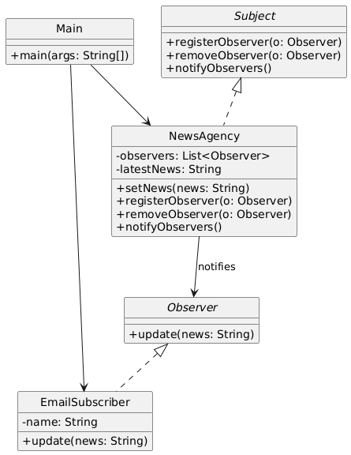

# 📰 News Feed Subscriber System (Console-Based)

---

## 🎯 Objective

To build a **console-based News Feed Subscriber System** using the **Observer Design Pattern**.  
Subscribers (observers) automatically receive updates when a news agency (subject) publishes news.

---

## 📦 Features

- Register multiple subscribers (observers)
- Send breaking news or updates from a central source (subject)
- All observers are notified in real-time (via console)
- Easy to extend with new subscriber types (e.g., SMS, Push)
- Clean modular design using interfaces and abstraction

---

## 🧠 Architecture & Modules

### 1. Observer Pattern Components

| Component     | Implementation             |
|---------------|-----------------------------|
| **Subject**   | `NewsAgency`                |
| **Observer**  | `EmailSubscriber`           |
| **Client**    | `Main`                      |

---

## 🔧 Classes & Responsibilities

- `Observer`:
    - Interface with `update(news)` method
- `EmailSubscriber`:
    - Implements `Observer` and prints news received
- `Subject`:
    - Interface to register, remove, and notify observers
- `NewsAgency`:
    - Maintains list of observers and sends out news
- `Main`:
    - Registers subscribers and triggers news updates

---

## 🧩 Observer Pattern – Recap

> The Observer Pattern establishes a one-to-many relationship where multiple observers get notified when the subject's state changes.

### ✅ Why It’s Useful Here

- Decouples publishers and subscribers
- Supports dynamic addition/removal of listeners
- Cleanly models event-based systems

---

## 📈 Future Enhancements

- Add more observer types: `SMSSubscriber`, `PushNotificationSubscriber`
- Persist subscription preferences
- Add categories/tags to news (sports, politics, etc.)
- Simulate real-time news push via timer or threads

---

## 📊 UML Diagram (Observer Pattern)

---

## 🏆 Outcome

You’ve built a real-world simulation of a **news feed broadcasting system** using the **Observer Design Pattern**.

This project demonstrates:
- Dynamic subscription handling
- Event-driven architecture in Java
- Scalable and decoupled design

The system is **modular**, **testable**, and extensible to real-time or GUI-based systems.