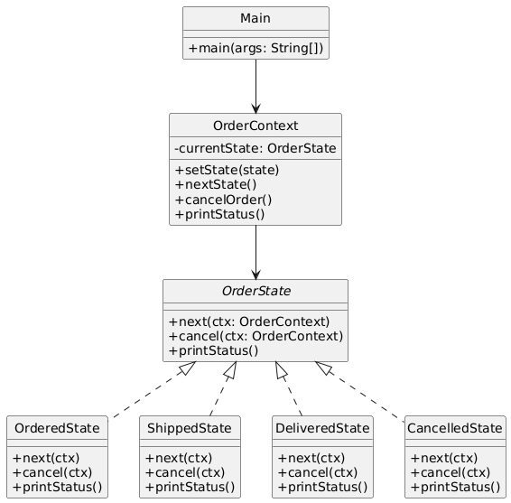

# 📦 Order Processing System (Console-Based)

---

## 🎯 Objective

To simulate an **order lifecycle management system** using the **State Design Pattern**.  
The order object changes behavior based on its internal state, such as Ordered, Shipped, Delivered, or Cancelled.

---

## 📦 Features

- Simulates transitions of order through different stages
- Dynamically changes behavior as state changes
- Supports cancellation at appropriate stages
- Prevents invalid transitions (e.g., cancelling after delivery)
- Clean separation of logic per state

---

## 🧠 Architecture & Modules

### 1. State Pattern Components

| Concept         | Implementation        |
|------------------|------------------------|
| **Context**      | `OrderContext`         |
| **State Interface** | `OrderState`       |
| **Concrete States** | `OrderedState`, `ShippedState`, `DeliveredState`, `CancelledState` |

---

### 2. State Behaviors

| State           | Transitions                        | Cancel Allowed |
|------------------|------------------------------------|----------------|
| Ordered         | ➡ Shipped                          | ✅ Yes         |
| Shipped         | ➡ Delivered                        | ✅ Yes         |
| Delivered       | ❌ No further transition            | ❌ No          |
| Cancelled       | ❌ No further transition            | ⚠ Already Done |

Each state implements `next()` and `cancel()` to control flow based on rules.

---

## 🧩 State Pattern – Recap

> The State Pattern encapsulates varying behavior for the same object based on its internal state.

### ✅ Why It’s Useful Here

- Eliminates if-else/switch hell
- Makes state transitions explicit and encapsulated
- Cleanly separates state responsibilities
- Makes it easy to add more states (e.g., Returned, OnHold)

---

## 📈 Future Enhancements

- Add return state (`ReturnedState`)
- Track timestamps for each state
- Persist state transitions for audit logging
- Add payment state as a parallel state machine

---

## 📊 UML Diagram (State Pattern)

---

## 🏆 Outcome

You’ve built a clean and modular simulation of an **Order Lifecycle System** using the **State Pattern**.

This project showcases:
- Behavioral change via polymorphism
- Encapsulation of logic per state
- Improved maintainability for workflow-based systems