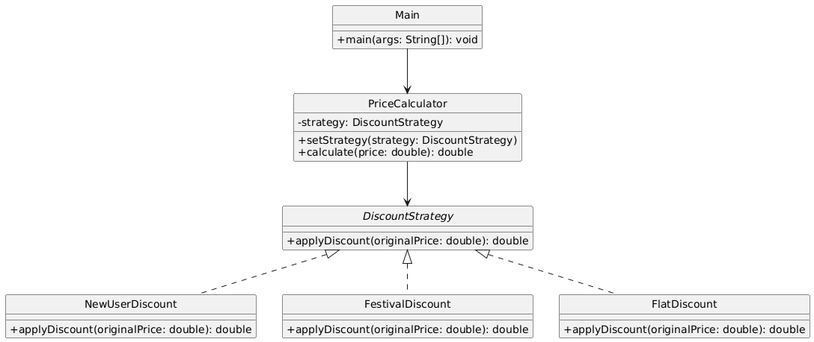

# 🎯 Discount Engine System (Console-Based)

---

## 🎯 Objective

To build a **console-based Discount Calculation Engine** using the **Strategy Design Pattern**, allowing dynamic selection of discount logic based on customer type or promotion.

---

## 📦 Features

- Applies different discounts: new user, festival, flat rate
- Dynamically chooses discount strategy at runtime
- Easy to add/remove new discount schemes
- Fully modular and cleanly structured

---

## 🧠 Architecture & Modules

### 1. Strategy Pattern Components

| Concept            | Implementation                |
|--------------------|--------------------------------|
| **Strategy Interface**   | `DiscountStrategy`         |
| **Concrete Strategies**  | `NewUserDiscount`, `FestivalDiscount`, `FlatDiscount` |
| **Context**              | `PriceCalculator`          |
| **Client**               | `Main`                     |

---

### 2. Discount Strategies

| Strategy           | Logic                                |
|--------------------|--------------------------------------|
| NewUserDiscount    | 20% off on all purchases             |
| FestivalDiscount   | 15% off if purchase > ₹1000          |
| FlatDiscount       | ₹100 flat off                        |

---

## 🧩 Strategy Pattern – Recap

> The Strategy Pattern allows selecting an algorithm's behavior at runtime, promoting flexibility and separation of concerns.

### ✅ Why It’s Useful Here

- Avoids deep if-else or switch statements
- Easily extendable for new discount policies
- Encourages encapsulated and reusable algorithms

---

## 📈 Future Enhancements

- Add `NoDiscount` strategy for base case
- Add `LoyaltyDiscount`, `SeasonalDiscount`
- Chain multiple discounts
- Integrate with order management system

---

## 📊 UML Diagram (Strategy Pattern)

---

## 🏆 Outcome

You’ve implemented a flexible, modular, and extensible **discount engine** using the **Strategy Pattern**.

This project demonstrates:
- Dynamic algorithm selection
- Clean separation of logic
- Real-world use of behavioral design patterns