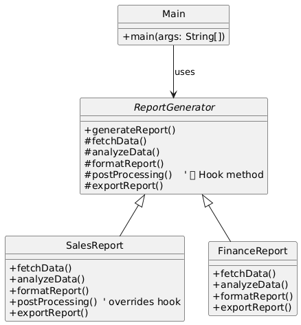

# 🧾 Report Generation System (Console-Based)


---

## 🎯 Objective

To build a **console-based Report Generation System** using clean object-oriented design principles and the **Template Method Design Pattern**, enriched with realistic logic and optional hook methods.

---

## 📦 Features

- Generate **Sales** and **Finance** reports
- Simulates real-world data and logic:
    - Sales: Total, average, and region-wise orders
    - Finance: Income, expenses, profit, and high-expense alerts
- Uses **hook method** to perform optional post-processing (e.g., archiving)
- Clearly formatted console output
- Fully **modular**, **extensible**, and **maintainable**

---

## 🧠 Architecture & Modules

### 1. Template Method Pattern

| Concept             | Implementation                        |
|---------------------|----------------------------------------|
| **Abstract Class**  | `ReportGenerator`                      |
| **Concrete Classes**| `SalesReport`, `FinanceReport`         |
| **Client**          | `Main`                                 |
| **Hook Method**     | `postProcessing()` (optional override) |

> ✅ The template defines the report structure and allows subclasses to plug in specific logic.

---

### 2. Report Flow Steps

The `generateReport()` method in `ReportGenerator` follows this structure:

1. `fetchData()` – Load sample data
2. `analyzeData()` – Process and compute stats
3. `formatReport()` – Display meaningful summary
4. `postProcessing()` – 🪝 *Hook* (optional logic)
5. `exportReport()` – Output destination logic

---

### 3. Hook in Action

The `SalesReport` overrides `postProcessing()` to simulate archiving data:

```java
@Override
protected void postProcessing() {
    System.out.println("🔒 Archiving sales data for audit...");
}
```

The `FinanceReport` skips this step, using the default no-op.

---

## 📁 Modules

### 🔹 `ReportGenerator.java`
- Defines the template method and steps
- Provides a default implementation for `postProcessing()`

### 🔹 `SalesReport.java`
- Simulates CRM sales data
- Calculates total, average, and region-wise counts
- Uses the hook to archive data

### 🔹 `FinanceReport.java`
- Simulates transactions
- Computes income, expenses, profit
- Highlights large expenses
- Overrides `exportReport()` to send an email

### 🔹 `Main.java`
- Runs both reports using the same template structure

---

## 🏁 Template Method Pattern – Recap

> The Template Method defines the **skeleton of an algorithm**, letting subclasses customize specific steps **without changing the overall flow**.

### ✅ Why It’s Useful Here

- Enforces consistency across reports
- Encourages reuse of common steps
- Supports **optional** customization via **hooks**
- New reports can be added with **minimal effort**

---

## 📈 Future Enhancements

- Add Inventory or HR reports
- Add `preProcessing()` hook (e.g., input validation)
- Persist reports to file/database
- Integrate with REST APIs

---

## 📊 UML Diagram

You can visualize the Template Method structure like this:



---

## 🏆 Outcome

You’ve built a **real-world**, **logic-rich**, and **pattern-driven** Java application using the Template Method pattern.

This project showcases:
- Concrete use of behavioral design principles
- Clean separation of business logic
- Use of optional hooks for modular flexibility

The system is **ready to scale**, **easy to maintain**, and ideal for growing reporting needs.