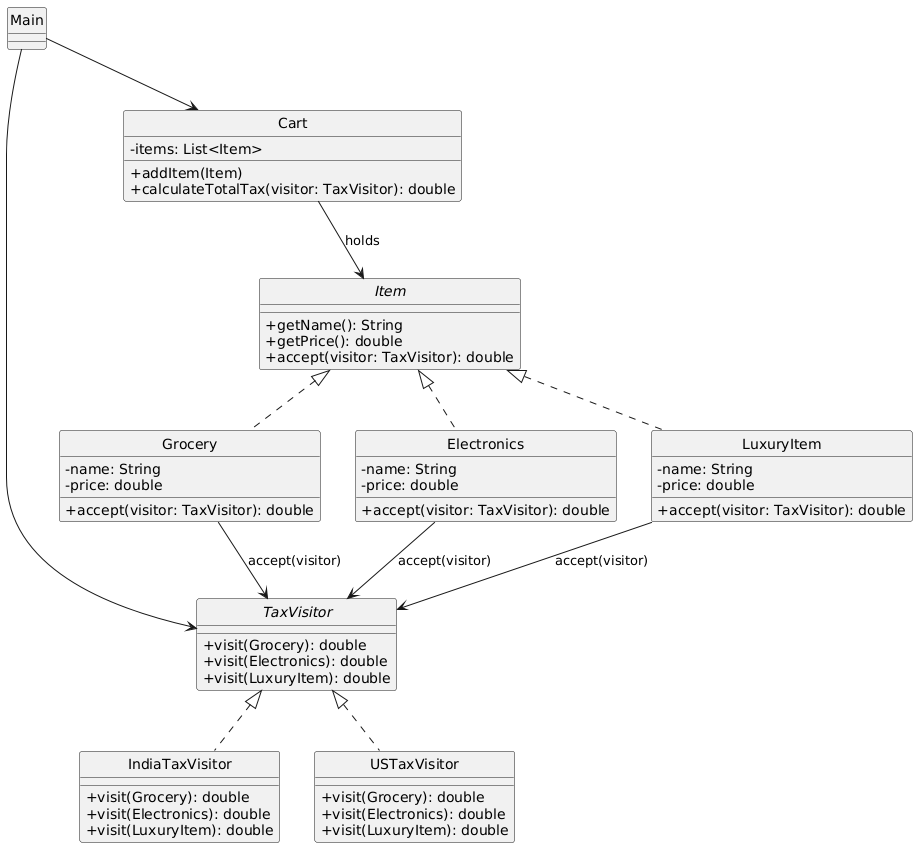

# 🧾 Tax Calculation System (Console-Based)

---

## 🎯 Objective

To build a **console-based Tax Calculation System** using clean object-oriented design principles and the **Visitor Design Pattern**, allowing dynamic operations on object hierarchies without modifying their structure.

---

## 📦 Features

- Supports different **item types**: Grocery, Electronics, Luxury
- Supports multiple **tax rules**: India, USA
- Calculates tax based on region-specific logic
- Uses the **Visitor pattern** for clean separation of tax logic from item data
- Fully **modular**, **extensible**, and **testable**

---

## 🧠 Architecture & Modules

### 1. Visitor Pattern

| Concept             | Implementation                            |
|---------------------|--------------------------------------------|
| **Element Interface** | `Item`                                   |
| **Concrete Elements**| `Grocery`, `Electronics`, `LuxuryItem`    |
| **Visitor Interface**| `TaxVisitor`                              |
| **Concrete Visitors**| `IndiaTaxVisitor`, `USTaxVisitor`         |
| **Client**          | `Cart`, `Main` class                       |

> ✅ Visitor allows adding new tax calculation logic **without changing** item classes.

---

## 🛒 Items and Tax Rules

| Item Type   | India Tax      | USA Tax       |
|-------------|----------------|---------------|
| Grocery     | 0%             | 5%            |
| Electronics | 18%            | 8%            |
| Luxury Item | 28%            | 20%           |

---

## 📁 Modules

### 🔹 `elements` package
- `Item` – Interface for cart items
- `Grocery`, `Electronics`, `LuxuryItem` – Item types implementing `Item`

### 🔹 `visitor` package
- `TaxVisitor` – Interface for visiting item types
- `IndiaTaxVisitor`, `USTaxVisitor` – Region-based tax logic

### 🔹 `model` package
- `Cart` – Aggregates items and calculates tax using a visitor

### 🔹 `Main.java`
- Demonstrates tax calculation for different countries

---

## 🏁 Visitor Pattern – Recap

> The Visitor pattern lets you define a new operation without changing the classes of the elements on which it operates.

### ✅ Why It’s Useful Here

- Keeps item classes focused only on data
- Cleanly separates calculation logic by region
- Adding a new region = 1 new class, no changes to items

---

## 📈 Future Enhancements

- Add discounts using `DiscountVisitor`
- Add receipt generation using `ReceiptVisitor`
- Add new tax rules (e.g., GST, import duty)
- Load items dynamically from user input or file

---

## 📊 UML Diagram

You can visualize the Visitor Pattern structure like this:

---

## 🏆 Outcome

You’ve built a **modular**, **realistic**, and **pattern-powered** Java application using the Visitor Pattern.

This project demonstrates:
- Clean decoupling of operations from data
- Ability to add new logic (visitors) without modifying existing classes
- Real-world usage of the Visitor pattern for rule engines, tax systems, and compilers