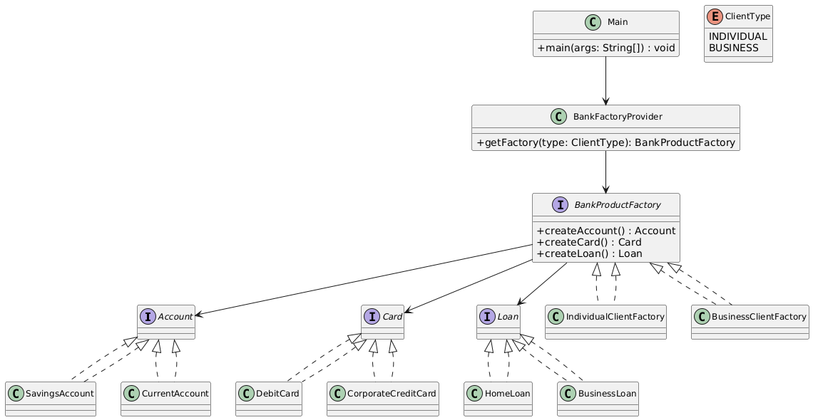

# 🏦 Banking Account Management System (Console-Based)

---

## 🎯 Objective

To build a **console-based Banking Account Management System (BAMS)** using modular design principles and the **Abstract Factory Design Pattern**.

---

## 📦 Features

- Support for **Individual** and **Business** clients
- Each client gets a complete product bundle:
    - Account
    - Card
    - Loan
- Clear separation of product families
- View product details via a clean console UI
- Easily **extendable** to new client types or products

---

## 🧠 Architecture & Modules

### 1. Product Interfaces

Each product type has its own interface:

- `Account`
- `Card`
- `Loan`

Each concrete implementation customizes the behavior:

- **Account**: `SavingsAccount`, `CurrentAccount`
- **Card**: `DebitCard`, `CorporateCreditCard`
- **Loan**: `HomeLoan`, `BusinessLoan`

---

### 2. Abstract Factory Design Pattern

| Concept                      | Implementation                          |
|-----------------------------|------------------------------------------|
| **Abstract Factory**        | `BankProductFactory`                     |
| **Concrete Factories**      | `IndividualClientFactory`, `BusinessClientFactory` |
| **Abstract Products**       | `Account`, `Card`, `Loan`                |
| **Concrete Products**       | `SavingsAccount`, `CurrentAccount`, etc. |
| **Factory Selector**        | `BankFactoryProvider`                    |
| **Client of Factory**       | `Main` class                             |

> ✅ This pattern ensures that each client type receives a consistent, coherent bundle of banking products.

---

### 3. User Interaction

- **Menu-driven Console UI**
    - Select client type
    - Factory creates appropriate product bundle
    - Display product details with `displayDetails()`
- **Main class** orchestrates the user flow, backed by the factory logic

---

## 🏁 Abstract Factory Pattern – Recap

> The Abstract Factory Pattern provides an interface for creating families of related or dependent objects without specifying their concrete classes.

### ✅ Why It’s Useful Here

- Keeps product creation logic consistent and centralized
- Avoids `if-else` or `switch` clutter in `Main`
- Simplifies addition of new client types (e.g., Premium, Startup)
- Demonstrates **product cohesion** within a client segment

---

## 📈 Future Enhancements

- Add authentication layer (e.g., client login)
- Support account operations (deposit, withdraw, balance)
- Add real-time interest calculation or credit limit logic
- Store product bundles persistently (file or DB)

---

## 📊 UML Diagram (Abstract Factory)

Visualize the Abstract Factory Pattern used in this project:

---

## 🏆 Outcome

You’ve implemented a **clean**, **scalable**, and **well-structured** Java console app using the **Abstract Factory Pattern**.  
This design pattern is extremely powerful when building systems where multiple variants of related objects must be created consistently.

---
