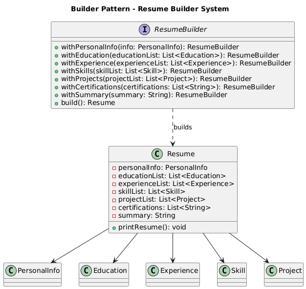

# 📄 Resume Builder System (Console-Based)

---

## 🎯 Objective

To build a **console-based Resume Builder System (RBS)** using clean, modular design practices and the **Builder Design Pattern**.

---

## 📦 Features

- Create resumes with:
    - Personal Information
    - Education
    - Experience
    - Skills
    - Projects
    - Certifications
    - Summary
- Uses the Builder pattern to manage **optional/mandatory** fields cleanly
- Generate and print the resume via console
- Clean output with structured formatting
- Fully **extensible**, **clean**, and **maintainable**

---

## 🧠 Architecture & Modules

### 1. Resume Structure

| Component         | Description                                 |
|------------------|---------------------------------------------|
| `Resume`         | The product class built using the builder   |
| `ResumeBuilder`  | Inner static class responsible for building |
| `PersonalInfo`   | Name, email, phone, LinkedIn, GitHub        |
| `Education`      | Degree, institution, year, CGPA             |
| `Experience`     | Role, company, duration, summary            |
| `Skill`          | Name and optional level                     |
| `Project`        | Title, description, technologies used       |

---

### 2. Builder Design Pattern

| Pattern Role      | Class/Implementation     |
|-------------------|--------------------------|
| **Product**       | `Resume`                 |
| **Builder**       | `ResumeBuilder` (inner)  |
| **Client**        | `Main`                   |

> ✅ This pattern is ideal when you want to build complex objects step-by-step, especially when not all fields are mandatory.

---

## 🏁 Builder Pattern – Recap

> The **Builder Pattern** separates the construction of a complex object from its representation so the same construction process can create different representations.

### ✅ Why It’s Useful Here

- You may or may not add Experience, Projects, Certifications, etc.
- Keeps your constructor clean and readable
- Offers step-by-step construction with validation
- Ensures immutability of the final object (`Resume`)

---

## 📈 Future Enhancements

- Make the app interactive (console-based input)
- Export resume to `.txt`, `.pdf`, or `.html`
- Add support for LinkedIn scraping or JSON import
- Add categories or levels to skills
- Support multiple resumes per user profile

---

## 📊 UML Diagram (Builder Pattern)

---

## 🏆 Outcome

You’ve learned to build a **modular**, **extensible**, and **builder-driven** resume console application.  
This project demonstrates real-world use of the **Builder Pattern** in Java for managing complex object construction with optional fields.

---
