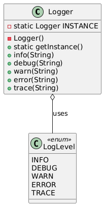

# 📄 Logger System (Console-Based)

---

## 🎯 Objective

To implement a **console-based Logger System** using the **Singleton Design Pattern**, ensuring that there is only one logger instance used throughout the application to print timestamped log messages of various levels.

---

## 📦 Features

- Global logger instance across the application
- Supports multiple log levels: `INFO`, `DEBUG`, `WARN`, `ERROR`, `TRACE`
- Prints logs with timestamp and log level
- Easily extendable to log into files or remote systems
- Optional tagging with class name for context
- Fully **modular**, **clean**, and **thread-safe**

---

## 🧠 Architecture & Components

### 1. Singleton Logger

- `Logger` class:
    - Private constructor
    - Static `getInstance()` method returns the only instance
    - Log methods for each level: `info()`, `debug()`, `error()`, `warn()`, `trace()`
    - Uses `DateTimeUtils` for timestamps

### 2. Log Level Enum

- `LogLevel` enum:
    - Defines: `INFO`, `DEBUG`, `WARN`, `ERROR`, `TRACE`

### 3. Utility

- `DateTimeUtils`:
    - Formats system time for consistent log timestamps

### 4. Main Driver

- `LoggerMain`:
    - Simulates log messages from different parts of the application
    - Demonstrates singleton behavior

---

## 🏁 Singleton Pattern – Recap

> The Singleton Pattern ensures that a class has only one instance and provides a global point of access to it.

### ✅ Why It’s Useful Here

- Centralized logging configuration
- No accidental multiple logger instances
- Controlled logging behavior system-wide
- Easy to extend for future features (e.g., log levels, output targets)

---

## 📈 Future Enhancements

- Write logs to a file
- Add log level filtering (e.g., suppress TRACE in production)
- Add thread-safe message queuing
- Add external configuration (e.g., log format, level thresholds)

---

## 📊 UML Diagram (Singleton Logger)

You can visualize the Singleton Design Pattern like this:

---

## 🏆 Outcome

You’ve learned to build a **fully functional**, **extensible**, and **pattern-driven** Java console application.  
This project demonstrates real-world application of the **Singleton Design Pattern** in a modular, centralized logging architecture.

By enforcing a single global logger instance, it ensures consistent and reliable logging behavior throughout your application — a common requirement in production systems.

---
