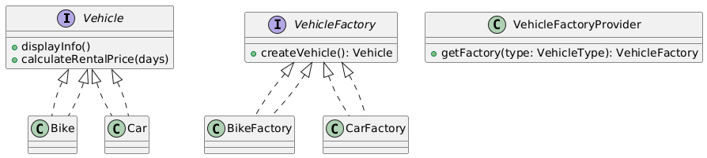

# 🚗 Vehicle Rental Management System (Console-Based)

---

## 🎯 Objective

To build a **console-based Vehicle Rental Management System (VRMS)** using clean, object-oriented design principles and the **Factory Method Design Pattern**.

---

## 📦 Features

- Rent **Bikes** or **Cars**
- View available vehicles with detailed specs
- Enter rental duration and get dynamic cost
- Generate unique booking IDs with timestamps
- Maintain and view **booking history**
- All interaction happens via an intuitive **console menu**
- Fully **extensible**, **modular**, and **cleanly structured**

---

## 🧠 Architecture & Modules

### 1. Vehicle Abstraction

- `Vehicle` (interface): exposes `displayInfo()` and `calculateRentalPrice(days)`
- `Bike` and `Car` implement the interface with their own properties and pricing logic

---

### 2. Factory Method Design Pattern

| Concept                      | Implementation                    |
|-----------------------------|------------------------------------|
| **Product Interface**       | `Vehicle`                          |
| **Concrete Products**       | `Bike`, `Car`                      |
| **Factory Interface**       | `VehicleFactory`                   |
| **Concrete Factories**      | `BikeFactory`, `CarFactory`        |
| **Factory Selector**        | `VehicleFactoryProvider`           |
| **Client of Factory Method**| `Main` class                       |

> ✅ This pattern allows us to encapsulate object creation logic and keep the `Main` program decoupled from specific vehicle types.

---

### 3. Booking System

- `Booking` class stores:
    - `bookingId`
    - `vehicleType`
    - `days`
    - `totalCost`
    - `bookingTime`
- `BookingService`:
    - Prompts for rental duration
    - Calculates cost
    - Creates and returns a `Booking`

---

### 4. User Interaction

- `ConsoleInputUtils`: Reusable utility class for safely reading input
- `Main` class:
    - Displays a menu: Make Booking / View History / Exit
    - Uses the appropriate factory via `VehicleFactoryProvider`
    - Displays booking confirmation
    - Stores and shows **booking history**

---

## 🏁 Factory Method Pattern – Recap

> The Factory Method defines an interface for creating an object, but lets subclasses decide which class to instantiate.

### ✅ Why It’s Useful Here

- Keeps `Main` unaware of actual vehicle types
- Makes adding new vehicles (e.g., Truck, Bus) easy
- Cleanly encapsulates creation logic per vehicle type

---

## 📈 Future Enhancements

- Add admin login to manage inventory
- Add support for return/cancel of bookings
- Store bookings to file/database
- Add a REST API or simple GUI

---

## 📊 UML Diagram (Factory Method)

You can visualize the Factory Method Design Pattern like this:

---

## 🏆 Outcome

You’ve learned to build a **fully functional**, **extensible**, and **pattern-driven** Java console application.  
This project demonstrates real-world application of the Factory Method pattern in a modular, scalable architecture.

---
