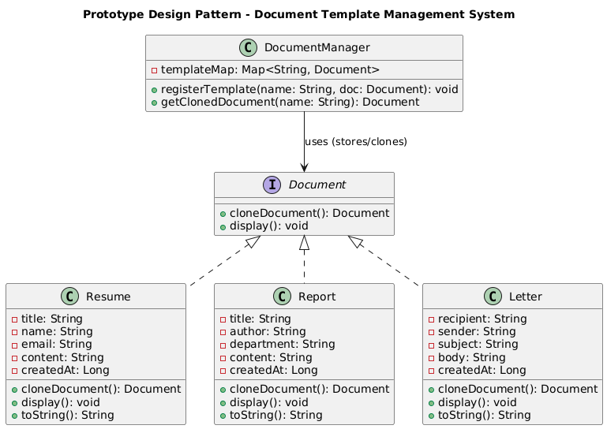

# 📝 Document Template Management System (Console-Based)

---

## 🎯 Objective

To build a **console-based Document Template Management System (DTMS)** using clean, object-oriented principles and the **Prototype Design Pattern**, allowing efficient cloning and reuse of document templates like **Resume**, **Report**, and **Letter**.

---

## 📦 Features

- Predefined templates: **Resume**, **Report**, **Letter**
- Instantly clone templates without rebuilding from scratch
- Templates created with **Builder Pattern** to enforce field validation
- Displays documents with consistent formatting and timestamps
- Easy-to-use **console menu**
- Fully **modular**, **extensible**, and **pattern-compliant**

---

## 🧠 Architecture & Modules

### 1. Document Abstraction

- `Document` (interface):
    - `cloneDocument()` – clones a document
    - `display()` – prints document details

- `Resume`, `Report`, and `Letter` implement `Document` interface
- Each document uses its own internal `Builder` class to handle safe construction

---

### 2. Prototype Design Pattern

| Concept               | Implementation                  |
|----------------------|----------------------------------|
| **Prototype Interface**     | `Document`                      |
| **Concrete Prototypes**     | `Resume`, `Report`, `Letter`    |
| **Prototype Registry**      | `DocumentManager`               |
| **Client**                  | `DocumentPrototypeMain` (menu)  |

> ✅ This pattern enables copying of complex objects without depending on their concrete classes.

---

### 3. Builder Pattern Integration

- Each document class has a corresponding builder
- Enforces required fields and avoids inconsistent object states
- Example: `Resume.builder().withTitle(...).withName(...).build();`

---

### 4. User Interaction

- `DocumentPrototypeMain`:
    - Console menu to **View Templates**, **Clone Document**, **Display Clones**, **Exit**
- `DocumentManager`:
    - Central registry to hold and manage document templates

---

## 🏁 Prototype Pattern – Recap

> The Prototype Pattern is used when object creation is expensive, and you want to avoid repeatedly creating similar objects. Instead, clone an existing instance.

### ✅ Why It’s Useful Here

- Efficiently manages reusable templates
- Avoids rebuilding documents from scratch
- Promotes template consistency
- Great for systems that require **copy-edit-publish** flows

---

## 📈 Future Enhancements

- Enable saving cloned documents to file
- Add editing features for cloned documents
- Allow dynamic template creation by admin
- Add export formats like PDF/Word

---

## 📊 UML Diagram (Prototype Pattern)

You can visualize the Prototype Pattern like this:

---

## 🏆 Outcome

You’ve implemented a **template-driven**, **prototype-based** Java console application that showcases the power of cloning reusable components with minimal coupling.  
This project demonstrates real-world application of the **Prototype Design Pattern** combined with **Builder Pattern** for safe object creation.

---
