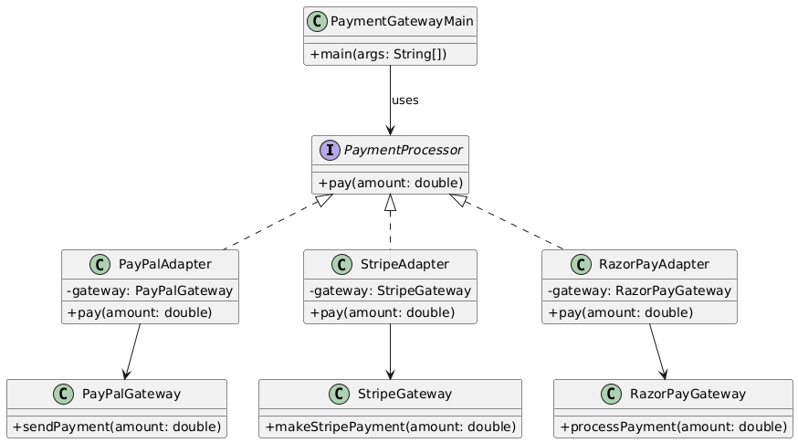

# 💳 Payment Gateway System (Console-Based)

---

## 🎯 Objective

To build a **console-based Payment Gateway System (PGS)** that supports multiple third-party payment services using the **Adapter Design Pattern**, allowing seamless integration without modifying existing code.

---

## 📦 Features

- Supports multiple payment gateways: **PayPal**, **Stripe** (more can be added easily)
- Common interface to handle all payment processors
- Simple console interface to simulate payment operations
- Easily extendable for additional gateways or payment types

---

## 🧠 Architecture & Modules

### 1. Payment Abstraction

- `PaymentProcessor` (interface): Exposes `pay(double amount)`
- Adapters implement this interface and connect to third-party APIs

---

### 2. Adapter Design Pattern

| Concept               | Implementation                  |
|----------------------|----------------------------------|
| **Target Interface**       | `PaymentProcessor`                |
| **Adaptee (3rd Party)**    | `PayPalGateway`, `StripeGateway`  |
| **Adapter**               | `PayPalAdapter`, `StripeAdapter`  |
| **Client**                | `PaymentClient` (Main class)      |

> ✅ This pattern allows your system to use different incompatible interfaces by adapting them to a standard one.

---

### 3. User Interaction

- `PaymentClient`:
    - Simulates payment requests using different gateways
    - Instantiates appropriate adapter and calls `pay()` method

---

## 🏁 Adapter Pattern – Recap

> The Adapter Pattern is used to make two incompatible interfaces work together. It allows integrating third-party systems without changing existing client code.

### ✅ Why It’s Useful Here

- Makes third-party SDKs plug-and-play
- Eliminates the need to modify client code
- Helps maintain **open/closed principle** – open for extension, closed for modification

---

## 📈 Future Enhancements

- Add more gateways like RazorPay, ApplePay, etc.
- Add real-time transaction logging
- Add support for currency conversion
- Introduce payment status callbacks

---

## 📊 UML Diagram (Adapter Pattern)

You can visualize the Adapter Pattern like this:

---

## 🏆 Outcome

You’ve implemented a **plug-and-play**, **adapter-based** Java console application that simplifies integration of third-party payment systems.  
This project demonstrates real-world use of the Adapter Pattern to build loosely coupled, highly extensible architecture.

---
