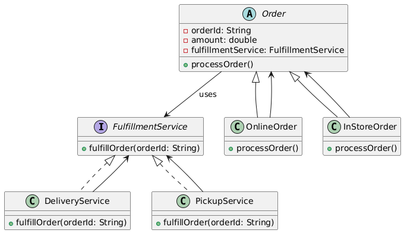

# 📦 Order Management System (Console-Based)

---

## 🎯 Objective

To build a **console-based Order Management System (OMS)** using the **Bridge Design Pattern**, enabling flexible combinations of different **order types** and **fulfillment methods** without class explosion.

---

## 📦 Features

- Place and process **Online** or **In-Store Orders**
- Choose between **Delivery** or **Pickup** fulfillment
- Modular design allows easily adding new order/fulfillment types
- Console-based menu-driven interaction
- Follows **Bridge Pattern** to decouple order abstraction from its implementation

---

## 🧠 Architecture & Modules

### 1. Abstractions

| Concept                  | Class                          |
|--------------------------|--------------------------------|
| **Abstraction**          | `Order` (abstract class)       |
| **Refined Abstractions** | `OnlineOrder`, `InStoreOrder`  |
| **Implementor**          | `FulfillmentService` (interface) |
| **Concrete Implementors**| `DeliveryService`, `PickupService` |

> ✅ Bridge Pattern separates abstraction (`Order`) from implementation (`FulfillmentService`), allowing both to vary independently.

---

### 2. Order Processing Flow

- `Order`: Abstract base with `processOrder()` method
- `OnlineOrder` & `InStoreOrder`: Extend `Order` and provide their specific behavior
- `FulfillmentService`: Interface for different fulfillment mechanisms
- `DeliveryService` & `PickupService`: Implement `FulfillmentService`

---

### 3. User Interaction

- `Main` class:
    - Console menu for:
        - Selecting order type
        - Entering order details
        - Selecting fulfillment method
        - Viewing confirmation
    - Demonstrates dynamic combinations without tightly coupled code

---

## 🏁 Bridge Pattern – Recap

> The **Bridge Pattern** decouples an abstraction from its implementation so that the two can vary independently.

### ✅ Why It’s Useful Here

- Easily add new `Order` types like `SubscriptionOrder`, `GiftOrder`
- Add new `Fulfillment` types like `DroneDelivery`, `LockerPickup`
- Avoids class explosion from every combination (e.g., OnlineDeliveryOrder, OnlinePickupOrder...)

---

## 📈 Future Enhancements

- Add `GiftOrder`, `SubscriptionOrder`
- Add third-party integrations like `RazorPay` or `ShipRocket`
- Store order history in files or database
- Add audit logging using Singleton Logger

---

## 📊 UML Diagram (Bridge Pattern)

You can visualize the Bridge Pattern like this:

---

## 🏆 Outcome

You’ve built a modular, scalable, and flexible **Order Management System** applying the **Bridge Pattern**, keeping the abstraction (`Order`) and implementation (`Fulfillment`) independent and easy to extend.

---
