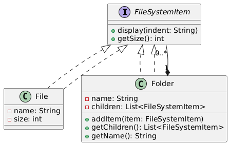

# 📂 File System Simulator (Console-Based)

---

## 🎯 Objective

To build a **console-based File System Simulator** that mimics file and folder hierarchies using the **Composite Design Pattern**, allowing both individual files and folder structures to be treated uniformly.

---

## 📦 Features

- Add **Files** and **Folders**
- Nest **Folders inside Folders**
- Add **Files to Folders**
- Display complete file/folder **structure**
- Compute and show **total folder size**
- Clean and intuitive **console interface**
- Recursively traverse folder trees

---

## 🧠 Architecture & Modules

### 1. File System Abstraction

| Component           | Role Description                               |
|---------------------|-------------------------------------------------|
| `FileSystemItem`    | Base interface with `display()` and `getSize()` |
| `File`              | Leaf element with name and size                 |
| `Folder`            | Composite that can contain nested items         |

---

### 2. Composite Design Pattern

| Concept           | Implementation         |
|------------------|------------------------|
| **Component**     | `FileSystemItem`       |
| **Leaf**          | `File`                 |
| **Composite**     | `Folder`               |
| **Client**        | `FileSystemSimulator`  |

> ✅ Composite pattern allows unified treatment of leaf and container objects, ideal for tree structures like file systems.

---

### 3. Utilities

- `ConsolePrinter`: Utility to format output and headings
- `FileSystemSimulator`: Main class with interactive menu to:
    - Add files or folders
    - Nest folders and files
    - Display structure
    - Compute total size

---

## 🏁 Composite Pattern – Recap

> The **Composite Pattern** is used when individual objects and compositions of objects need to be treated uniformly.  
It enables building hierarchical structures like file systems, organizational charts, or UI components.

---

## 📈 Future Enhancements

- Add delete functionality
- Persist file system state in memory or disk
- Support renaming files/folders
- Export tree structure to a text file or JSON

---

## 📊 UML Diagram (Composite Pattern)

You can visualize the Composite Pattern like this:

---

## 🏆 Outcome

You’ve built a **hierarchical, recursive**, and **pattern-driven** console application that simulates a real-world file system using the **Composite Design Pattern** in Java.  
This demonstrates how to treat individual objects (files) and compositions (folders) uniformly, making your design both **clean** and **extensible**.  
It’s a strong example of solving **tree-structured problems** using object-oriented principles.

---