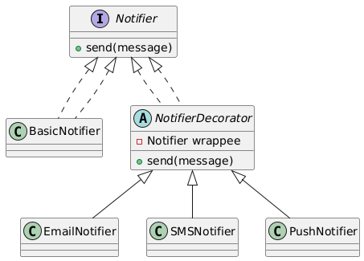

# 🔔 User Notification System (Console-Based)

---

## 🎯 Objective

To build a **console-based User Notification System** using the **Decorator Design Pattern**, enabling dynamic composition of multiple notification channels like Email, SMS, and Push Notifications.

---

## 📦 Features

- Base notifier logs generic notification
- Optional add-ons:
    - 📧 Email notification
    - 📱 SMS notification
    - 🔔 Push notification
- Dynamically wraps behavior using decorators
- Console-based interaction
- Easily extendable with more notification types

---

## 🧠 Architecture & Modules

### 1. Core Interface

| Component     | Description                     |
|---------------|---------------------------------|
| `Notifier`    | Interface with `send(message)` method |
| `BasicNotifier` | Concrete base notifier             |

---

### 2. Decorator Pattern Components

| Role              | Class                        |
|-------------------|------------------------------|
| **Component**     | `Notifier`                   |
| **ConcreteComponent** | `BasicNotifier`           |
| **Decorator**     | `NotifierDecorator`          |
| **ConcreteDecorators** | `EmailNotifier`, `SMSNotifier`, `PushNotifier` |

> ✅ Decorators wrap the notifier dynamically to add new behavior without altering the base notifier logic.

---

## 🖥️ User Interaction

- Prompt user to enter a message
- Prompt for notification channels (Email, SMS, Push, All)
- Sends message through the selected channels

---

## 📈 Future Enhancements

- Add file-based logging
- Add Slack or WhatsApp notifier
- Send scheduled/batch notifications
- REST API to accept notification jobs

---

## 📊 UML Diagram (Decorator Pattern)

---

## 🏆 Outcome

You've built a **flexible, extendable**, and **pattern-compliant** user notification system using Java.  
This demonstrates the real-world use of the **Decorator Pattern**, making it easy to **dynamically add behavior** without altering existing code.
