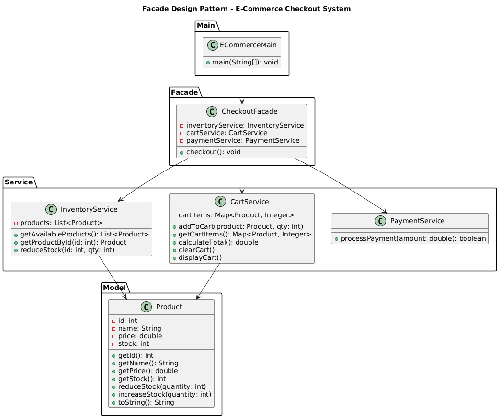

# 🛒 E-Commerce Checkout System (Console-Based)

---

## 🎯 Objective

To build a **console-based E-Commerce Checkout System** using **object-oriented principles** and the **Facade Design Pattern** that simplifies complex operations like inventory management, cart handling, and payment processing.

---

## 📦 Features

- View available products with stock and price
- Add products to cart
- View cart summary with total price
- Simulate checkout with payment processing
- Stock updates after successful order
- Clear separation of concerns via layered services
- All user interaction via an intuitive **console menu**

---

## 🧠 Architecture & Modules

### 1. Core Model

- `Product`: Represents an item with `id`, `name`, `price`, and `stock`
- Methods include:
    - `reduceStock()`
    - `increaseStock()`
    - `toString()` for display

---

### 2. Services

| Service             | Responsibility                                                  |
|---------------------|------------------------------------------------------------------|
| `InventoryService`  | Maintains product list and stock level                          |
| `CartService`       | Manages cart items and total cost                               |
| `PaymentService`    | Simulates payment process (can be extended to real gateways)    |

---

### 3. Facade Layer

- **`CheckoutFacade`**
    - Acts as a unified interface that:
        - Validates stock
        - Processes payment
        - Reduces stock
        - Clears cart
    - Hides complexity of individual services

> ✅ This reduces direct coupling between `main()` and internal systems.

---

### 4. User Interaction

- `ECommerceMain` (entry point)
    - Menu to:
        - View Products
        - Add to Cart
        - View Cart
        - Checkout
        - Exit
    - Uses `Scanner` for CLI input
    - Demonstrates real-world flow of an e-commerce checkout

---

## 🏁 Facade Pattern – Recap

> The **Facade Pattern** provides a unified interface to a set of interfaces in a subsystem, making it easier to use.

### ✅ Why It’s Useful Here

- Prevents the main application from knowing every detail of `CartService`, `InventoryService`, and `PaymentService`
- Encapsulates the entire **checkout logic** in a single, coherent interface
- Promotes modularity, cleaner code, and easier maintenance

---

## 📈 Future Enhancements

- Add user authentication and order history
- Add product categories and search
- Integrate real payment gateways (Stripe, Razorpay)
- Persist data to file or database
- Add GUI or REST API layer

---

## 📊 UML Diagram (Facade Pattern)

---

## 🏆 Outcome

You’ve implemented a **modular**, **pattern-driven**, and **scalable** checkout system that mimics a real e-commerce flow.  
This project demonstrates the power of the **Facade Design Pattern** by simplifying complex internal operations into a clean, easy-to-use interface.

---
