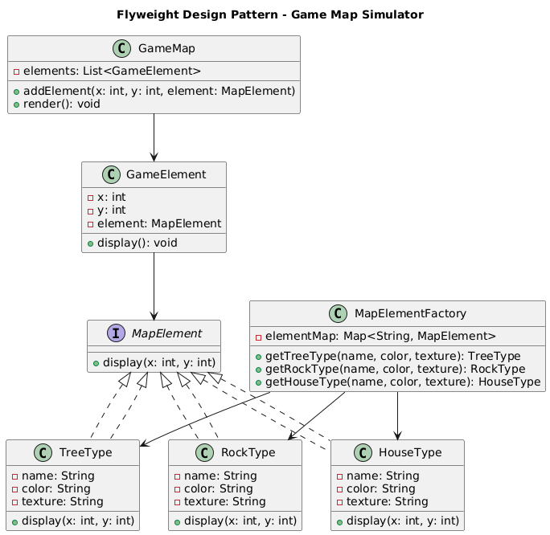

# 🗺️ Game Map Flyweight (Console-Based)

  
  

---

## 🎯 Objective

To build a **console-based Game Map Simulator** using clean, object-oriented design principles and the **Flyweight Design Pattern**, optimizing memory by sharing intrinsic properties of repeated map elements like trees, rocks, and houses.

---

## 📦 Features

- Add millions of elements (🌳 Trees, 🪨 Rocks, 🏠 Houses) to a game map
- Avoid memory bloat using the Flyweight pattern
- Compare memory usage: **Flyweight vs Without Flyweight**
- Dynamically display map elements at various coordinates
- Fully **modular**, **efficient**, and **extensible**

---

## 🧠 Architecture & Modules

### 1. Map Abstraction

- `MapElement` (interface): exposes `display(x, y)`
- `TreeType`, `RockType`, `HouseType` implement `MapElement`
- Each concrete type stores **shared** attributes like color, name, texture

---

### 2. Flyweight Design Pattern

| Concept                | Implementation                   |
|------------------------|-----------------------------------|
| **Flyweight Interface**| `MapElement`                      |
| **Concrete Flyweights**| `TreeType`, `RockType`, `HouseType` |
| **Flyweight Factory**  | `MapElementFactory`               |
| **Client**             | `GameElement` + `GameMap`         |

> ✅ This pattern helps reduce memory usage by sharing immutable, heavy data between instances.

---

### 3. Map Composition

- `GameElement`: represents an object on the map (with extrinsic state like `x`, `y`)
- `GameMap`: holds list of all elements and renders them using shared flyweight instances

---

### 4. User Interaction

- `GameMapMain`:
    - Create 1M or 10M game elements
    - Compare memory usage with and without Flyweight
    - Render map with `display()` calls to simulate placement

---

## 🏁 Flyweight Pattern – Recap

> The Flyweight Pattern minimizes memory usage by sharing as much data as possible with similar objects.

### ✅ Why It’s Useful Here

- Saves memory when using millions of similar elements
- Avoids duplication of common properties (e.g., tree type, color, texture)
- Promotes performance and scalability in games or graphical systems

---

## 📈 Future Enhancements

- Add custom game grid rendering
- GUI visualization using JavaFX or Swing
- Export game map to a file (e.g., JSON)
- Add element removal/editing logic

---

## 📊 UML Diagram (Flyweight)

You can visualize the Flyweight Design Pattern like this:

---

## 🏆 Outcome

You’ve implemented a **memory-efficient**, **pattern-compliant**, and **scalable** Java console application that renders millions of game elements without duplicating shared data.  
This project demonstrates real-world application of the **Flyweight Pattern** in systems where **performance and memory optimization** are critical.

---