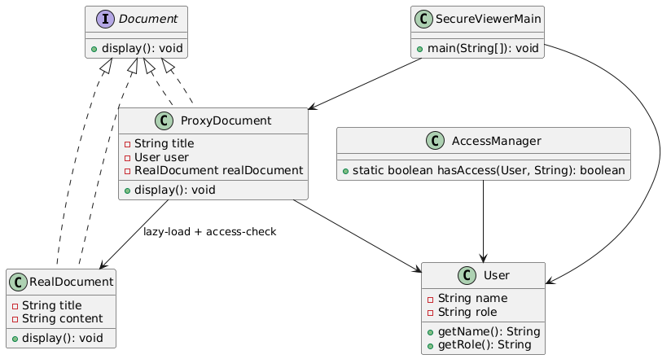

# 🔐 Secure Document Viewer (Console-Based)

---

## 🎯 Objective

To build a **console-based Secure Document Viewer (SDV)** using the **Proxy Design Pattern**, simulating **access control** and **lazy loading** mechanisms for document viewing based on user roles.

---

## 📦 Features

- View documents based on **user role** (ADMIN / USER)
- **Access Control Proxy** ensures only authorized users can view sensitive documents
- **Lazy Loading**: Actual document content is loaded only when first accessed
- Console-based interaction to simulate real-world user access
- Clean separation of concerns using **OOP principles**

---

## 🧠 Architecture & Modules

### 1. Document Abstraction

- `Document` (interface): defines `display()` method
- `RealDocument`: contains actual content (heavy object)
- `ProxyDocument`: controls access and defers creation of `RealDocument`

---

### 2. Proxy Design Pattern

| Concept                     | Implementation           |
|----------------------------|--------------------------|
| **Subject Interface**      | `Document`               |
| **Real Subject**           | `RealDocument`           |
| **Proxy**                  | `ProxyDocument`          |
| **Client**                 | `SecureViewerMain`       |

> ✅ Proxy encapsulates security checks and lazy loading before allowing access to the real document.

---

### 3. Access Control

- `User`: Represents a system user with name and role (`ADMIN`, `USER`)
- `AccessManager`: Verifies whether a user can access a document

---

### 4. User Interaction

- `SecureViewerMain`:
    - Simulates login
    - Lists document titles
    - Tries to display selected document via proxy
    - Shows appropriate message based on permission

---

## 🏁 Proxy Pattern – Recap

> A **Proxy** provides a surrogate or placeholder for another object to control access to it.

### ✅ Why It’s Useful Here

- Prevents unauthorized users from accessing sensitive resources
- Delays expensive object creation (i.e., document loading)
- Adds additional logic (like logging, caching, security) **without modifying the real object**

---

## 📈 Future Enhancements

- Load document content from files or database
- Add document editing functionality for ADMIN users
- Introduce logging proxy for audit trail
- Support user sessions and multiple roles

---

## 📊 UML Diagram (Proxy Pattern)

You can visualize the Proxy Design Pattern used in this project like this:

---

## 🏆 Outcome

You’ve built a **secure, role-aware document viewer** using the Proxy Design Pattern.  
This project shows how to wrap real objects with additional logic like **access control** and **lazy loading**, mimicking how real-world systems (like Spring Security) manage sensitive resources efficiently and securely.

---
